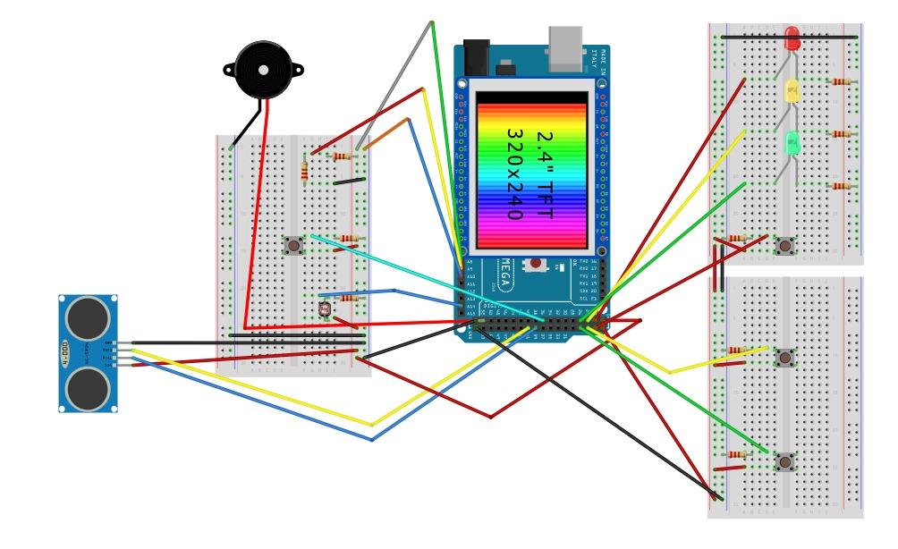

# ENG1419 - 2019.1 - Sem Tempo, Irmão
This is the final assignment for ENG1419 - Microcontrollers Programming in Pontifical Catholic University of Rio de Janeiro (PUC-Rio).

## Group members
[Fernando Homem da Costa](https://github.com/nandohdc)

[Gabriel de Andrade Busquim](https://github.com/gbusquim)

[Pedro Escalfoni Moraes](https://github.com/pedroescalfonimoraes)

[Pedro Sousa Meireles](https://github.com/psmeireles)

## Assignment
This assignment was an open project. The only restrictions were it should use both software and hardware and should use some kind of data persistance.

Inspired in the famous game Keep Calm And Nobody Explodes, we decide to create a bomb defusal game with an Arduino Mega. The Arduino has different modules simulating modules of the bomb, and the player should do different activities simultaneously in order to succeed at the game. The activities the player must do are shown in a website, which also has a timer for the bomb to explode. 

The modules are divided in two categories: fixed and periodic. The player must complete 3 fixed challenges to win the game, but it won't be easy, as other challenges appear periodically to make things harder.

The fixed challenges are a Genius game and a puzzle to connect wires in an asked order. 

The periodic challenges involve timer, distance and light. The first one is a countdown that is reset when the player presses a button. The distance challenge requires the player to mantain some distance from the sensor for a specific amount of time. The light challenge works just like the distance one, but with light.

If the bomb timer reaches 0 or the player makes 3 failures in any of the challenges, the bomb explodes.

Good luck!

## How to run
First upload the Arduino sketch to the Arduino Mega. Then start the database by running `mongo` from a terminal. Finally, from the base folder of this repository run the following commands in different terminals:
```python
  python PythonServer/arduino_to_flask.py
  
  python Micro-PaginaWeb/flaskserver.py
```
In your browser go to `localhost:5000` and press `Start` in the Arduino.

## Circuit schematic
The circuit schematic can be found in the file [Circuit/SemTempoIrmao.fzz](Circuit/SemTempoIrmao.fzz).



## Demo (in Portuguese)
[](http://www.youtube.com/watch?v=SaZhI4S7CrI "Demo")
